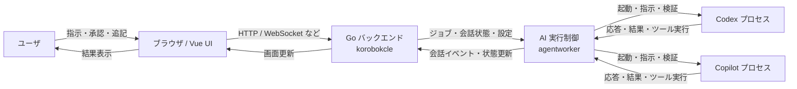

---
# AI 実行をチャット操作として扱うための UI 方針

- Status: Accepted
- Date: 2026-07-06
- Scope: `korobokcle` 全体

## Context

`korobokcle` では、AI に指示を出し、その結果を確認し、人間の判断を挟みながら処理を進める流れが中心になっている。
現状の画面は、ジョブ詳細、成果物、ログ、設定といった個別のビューに分かれており、AI への指示、AI の応答、ユーザの応答待ちを一連の会話として追いにくい。

今後は次のような操作を、単なるログ表示ではなくチャット的な対話として扱いたい。

- AI への指示をチャットで入力する
- AI の応答やツール実行結果を会話として表示する
- 人間の承認・却下・追記をチャットの返答として扱う
- 実行待ち、確認待ち、エラー、再実行を会話状態として見せる

この用途では、汎用チャット UI をそのまま入れるより、`korobokcle` の実行状態に合わせた会話モデルを持つ方が適している。

## Decision

`korobokcle` の AI 実行 UI は、`vue-advanced-chat` を土台にした「AI 実行の会話タイムライン」として実装する。
会話の単位はメッセージではなく、実行イベントと状態遷移を含む会話ターンとする。

採用方針は次のとおり。

1. 会話 UI は `vue-advanced-chat` をベースに拡張する
2. 長い履歴表示には仮想スクロールを使う
3. 入力欄はまずシンプルなテキスト入力を維持する
4. AI、システム、人間、ツール、承認要求を同じ会話タイムラインに載せる
5. ユーザ応答待ちを会話状態として可視化する
6. 会話タイムラインに収まらない補助情報は別パネルで扱う

この ADR では、`vue-advanced-chat` の採用を決定事項とする。
同時に、会話として扱うべき状態と、拡張で追加する責務の範囲を固定する。

## Screen Design

### Target Screens

主画面はジョブ詳細内の AI 実行領域であり、利用者はここで AI への指示、実行状況の確認、承認、再実行を行う。
既存のジョブ一覧や設定画面は残しつつ、AI 実行の進行はこの画面で完結させる。

画面の目的は次の 3 つである。

1. 今どのジョブがどの状態にあるかを即座に把握する
2. AI への指示と応答を時系列で追えるようにする
3. 承認待ち、再実行待ち、エラーを会話の流れとして扱う

### Desktop Wireframe

```text
┌──────────────────────────────────────────────────────────────────────┐
│ ジョブ詳細                                                           │
│ [一覧へ戻る]                                 [再実行] [承認] [却下]  │
├──────────────────────────────────────────────────────────────────────┤
│ ジョブ情報  状態  実行中ステータス  対象リポジトリ  取得時刻          │
├──────────────────────────────────────────────────────────────────────┤
│ 会話タイムライン                                                     │
│ ┌ system ----------------------------------------------------------┐ │
│ │ 実行開始、現在は設計中です                                       │ │
│ └──────────────────────────────────────────────────────────────────┘ │
│ ┌ user ------------------------------------------------------------┐ │
│ │ 設計を開始してください                                           │ │
│ └──────────────────────────────────────────────────────────────────┘ │
│ ┌ assistant -------------------------------------------------------┐ │
│ │ 設計結果、確認項目、テスト計画                                   │ │
│ └──────────────────────────────────────────────────────────────────┘ │
│ ┌ approval_request ------------------------------------------------┐ │
│ │ コマンド許可が必要です [1回のみ] [セッション内] [ワークスペース] │ │
│ └──────────────────────────────────────────────────────────────────┘ │
├──────────────────────────────────────────────────────────────────────┤
│ 入力欄                                                               │
│ [メッセージ入力.................................................][送信]│
└──────────────────────────────────────────────────────────────────────┘
```

### Mobile Difference

- 上部のジョブ情報は折り返して縦積みにする
- 操作ボタンは 1 行に収まらない場合、優先度順に折り返す
- 会話タイムラインは横幅を優先し、入力欄は画面下部に固定する
- 承認カードのボタンは横並びをやめ、縦並びにして誤操作を防ぐ

### State Differences

- `idle`
  - まだ AI 実行が始まっていない
  - 入力欄のみ表示する
- `running`
  - 実行中メッセージを表示する
  - 直近イベントを自動で追従表示する
- `awaiting_user`
  - 人間の返答待ちを表示する
  - 入力欄を有効化する
- `awaiting_permission`
  - コマンド許可カードを表示する
  - テキスト入力よりもボタン選択を優先する
- `retrying`
  - 再実行中であることを強調表示する
  - 前回の失敗理由と今回の再試行回数を見せる
- `passed`
  - 成功結果を強調表示する
  - 会話履歴は残したまま、入力欄は通常状態に戻す
- `changes_requested`
  - 修正要求を強調表示する
  - 必要なら次の入力へつなげる
- `failed`
  - 失敗理由を最上位で表示する
  - 再実行できる場合は再実行導線を残す

### Operations

- ジョブ詳細を開くと、最新の会話状態を表示する
- AI 実行中は、会話イベントが増えるたびに画面を更新する
- 許可要求が来たら、会話内の承認カードで応答する
- 承認後は同じ会話スレッドに結果を追記する
- 再実行時は、前回履歴を消さずに新しいターンを追加する
- エラー時は、エラー内容と再実行導線を同じ画面内に残す

### Result Log Edit

現在の `結果`、`ログ`、`編集` は、会話タイムラインを中心に次のように役割分担する。

#### 結果

- これまでの「成果物」や「レビュー結果」は、会話タイムライン上の `assistant` または `status_change` として表示する
- 画面の主結果は、最新ターンの要約と状態ラベルで把握する
- 成功・失敗・差し戻しの結論は、別画面ではなく現在の会話の末尾で確認できる
- 必要なら、結果全文を折りたたみブロックとして残す

#### ログ

- ログは会話の本体ではなく、結果を裏付ける補助情報として扱う
- 実行ログは `attempt` や `role` ごとにまとまり、必要時だけ展開する
- 画面上ではデフォルトで閉じ、必要なときにだけ確認する
- ログだけを見ても進行状況は追えるが、最終的な判断は会話の結果側で行う

#### 編集

- 編集は、過去メッセージの直接書き換えではなく、新しい入力ターンとして扱う
- 利用者が内容を修正したい場合は、入力欄で追記または再指示を送る
- 編集中は、画面更新で入力内容が失われないようにする
- 既に確定した結果やログは編集対象にしない
- 必要に応じて、編集モードの間は自動更新を止める

### Text and Constraints

- 表示文言は日本語に統一する
- AI の内部状態名は英語のまま保持してよい
- 入力欄は自由入力だが、承認カードが出ている場合はボタン操作を優先する
- 長文ログは折りたたみ可能にし、必要時だけ展開する
- 結果は要約を先に、全文を後から見せる
- 編集対象は利用者入力に限定し、AI の出力は原則固定する

### Accessibility

- ボタンはキーボード操作できること
- 現在の状態が色だけでなく文言でも分かること
- スクリーンリーダー向けに、状態変化と承認要求を読み上げられること
- フォーカス位置が会話更新で失われないこと

### Open Items

- 会話イベントの保存単位をメッセージとするか、実行ターンとするか
- 入力欄に Markdown 補助を入れるかどうか
- 長大なログをどこまで会話に含め、どこから別ビューに分けるか

## Considered Options

### Option A: `vue-advanced-chat` を採用する

特徴:

- すぐにチャット風 UI を出せる
- メッセージ、ルーム、typing、system message などの概念がある
- フレームワーク非依存寄りで導入しやすい

懸念:

- `rooms/messages` 前提が強く、`korobokcle` の「ジョブ進行」「承認待ち」「再実行待ち」と完全には噛み合わない
- ワークフロー固有の状態表現を、既存のデータ構造に合わせて曲げる必要がある
- UI の自由度より、既成チャットの都合が勝ちやすい

採用理由:

- 会話ベースの UI を短期間で実装しやすい
- メッセージ、system 表示、入力欄、履歴表示の土台がある
- 既存 Vue/TypeScript 構成に大きな置換を入れずに組み込める

### Option B: `PrimeVue` や `Quasar` で画面全体を置き換える

特徴:

- UI コンポーネントが豊富
- 画面全体の統一感を作りやすい

懸念:

- `korobokcle` は既に Vue + 独自コンポーネントで十分に構成されているため、全面置換はコストが高い
- `PrimeVue` は 2026-06-28 時点で archive されており、新規採用先としては将来性に難がある
- `Quasar` はアプリ全体の基盤としては強いが、チャット機能のためだけに採るには重い

### Option C: 自前の会話タイムライン + 必要最小限のライブラリを採用する

特徴:

- `AI 指示 -> 実行 -> 結果 -> 人間応答 -> 再実行` をそのまま表現できる
- チャットではなく「進行中の作業 UI」として状態を持たせやすい
- 既存画面と自然に統合できる

懸念:

- 実装量は増える
- 履歴表示や入力体験は自前設計が必要

## Scorecard

選定基準は、星の数だけでなく、今回の用途への適合度を重視する。

| 候補 | Stars | 会話状態表現 | 実行ログ適合 | 保守性 | 総合判断 |
| --- | ---: | --- | --- | --- | --- |
| `vue-virtual-scroller` | 10.8k | 高い | 高い | 高い | 採用候補 |
| `vue-advanced-chat` | 2.1k | 中 | 中 | 中 | 採用 |
| `PrimeVue` | 14.5k | 中 | 低い | 低い | 不採用 |
| `Quasar` | 27.2k | 中 | 低い | 中 | 不採用 |

判断の軸:

- 星の数は採用判断の補助情報にとどめる
- `AI 実行の状態表現` と `人間応答待ち` の表現力を最優先する
- 新規の画面基盤を増やしすぎない
- 既存の Vue 実装に対する導入コストと、会話タイムラインへの拡張しやすさを重視する

## Design

### 概念図



この図の意図:

- ユーザはブラウザで会話する
- ブラウザはバックエンドと通信する
- バックエンドはジョブ状態と会話履歴を管理する
- `agentworker` が `codex` / `copilot` を個別プロセスとして起動する
- AI プロセスの結果は、単なるログではなく会話イベントとして UI に戻す

### 1. 会話モデルをイベント駆動で扱う

会話は、単純な user / assistant の往復ではなく、次のイベントを持つ。

- `system`
- `user`
- `assistant`
- `tool`
- `approval_request`
- `approval_response`
- `status_change`
- `error`

このモデルにより、AI の実行結果だけでなく、途中の承認待ちや再実行指示も会話として並べられる。

### 2. 状態を会話の一部として表示する

画面上の状態は、別パネルではなく会話タイムラインの一項目として表現する。

- `running`
- `awaiting_user`
- `awaiting_permission`
- `retrying`
- `passed`
- `changes_requested`
- `failed`

ユーザが見たときに「今どこで止まっているか」が一目で分かることを重視する。

### 3. 入力欄は段階的に拡張する

初期段階では、入力欄はシンプルなテキスト入力にとどめる。

- まずは指示文を送れることを優先する
- Markdown や rich input は必要になってから追加する
- ユーザの返答は、承認、却下、追記コメントを自然に入力できればよい

### 4. 長い会話履歴は仮想スクロールで扱う

AI のログや検証結果は長くなりやすいため、表示負荷を抑えるために仮想スクロールを使う。

- 大量のメッセージでも操作感を落としにくい
- ログ表示と会話表示を同じ仕組みで扱いやすい

### 5. コマンド許可はチャット内の選択 UI で処理する

AI がコマンド実行の許可を求める場合は、テキスト返信ではなく、会話タイムライン内の承認カードとして表示する。

承認カードには、少なくとも次の 3 つの選択肢をボタンで提示する。

- `1回のみ許可`
- `セッション内は許可`
- `ワークスペースで許可`

このとき、AI 側の要求内容に応じて表示文言は変えてよいが、ユーザが選ぶ操作は明確なボタン選択に寄せる。
キーボード入力だけに依存せず、ワンクリックで意思決定できることを重視する。

#### 承認カードのワイヤーフレーム

```text
┌──────────────────────────────────────────────┐
│ AI がコマンド実行の許可を求めています        │
│                                              │
│ 実行予定: `go test ./...`                    │
│ 範囲: ワークスペース `issue-159`             │
│ 理由: 変更後の検証を行うため                 │
│                                              │
│ [1回のみ許可] [セッション内は許可] [ワークスペースで許可] │
└──────────────────────────────────────────────┘
```

#### 選択肢の意味

- `1回のみ許可` は、現在のコマンド 1 回だけを許可する
- `セッション内は許可` は、現在の AI 実行セッション中に同種の要求を再承認不要にする
- `ワークスペースで許可` は、同じワークスペースに属する今後の要求にも許可を広げる

承認 UI は、危険度の高い選択肢ほど見た目で区別できることが望ましい。
たとえば、`ワークスペースで許可` は他より強い権限として、誤クリックを避けるために補足説明を付ける。

### 6. 汎用チャット製品への全面依存は避ける

`vue-advanced-chat` のような既成チャット部品は試作には向くが、本件では採用しない。

理由:

- `korobokcle` の会話は、単なるメッセージ交換ではなくワークフローの進行である
- 既存チャットのルーム概念より、ジョブ単位の進行状態の方が重要である
- 後から承認や再実行を追加すると、既成チャットのデータモデルに引きずられやすい

## Consequences

### Benefits

- AI への指示、結果、ユーザの応答が一続きで追える
- 承認待ちや再実行待ちを UI 上で明確にできる
- 既存のジョブ詳細、ログ、成果物と整合しやすい
- 画面遷移ではなく「会話の流れ」でワークフローを理解できる

### Trade-offs

- 実装は既製チャット導入より増える
- 会話イベントの設計をアプリ側で持つ必要がある
- UI と状態管理の責務がやや重くなる

### Risks

- 会話モデルが肥大化すると、ログと操作が混ざって分かりにくくなる
- 承認要求や再実行をメッセージ化しすぎると、通常のチャットとワークフローの境界が曖昧になる
- 仮想スクロール導入時に、スクロール位置や新着追従の挙動を丁寧に詰める必要がある

## Notes

- この ADR は UI の方向性を定めるものであり、API の最終形は今後の実装で調整してよい。
- 既存のジョブ一覧、ジョブ詳細、設定画面は残しつつ、AI 実行部分を会話タイムラインへ寄せる。
- 将来的に入力補助や rich editor を追加する余地は残す。
